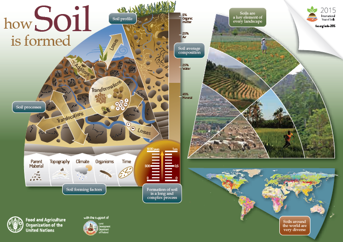
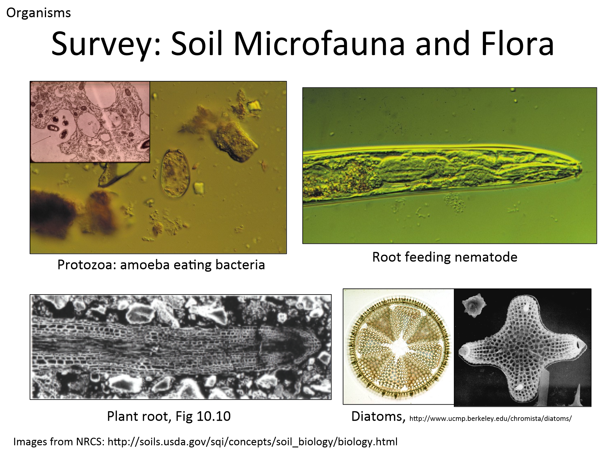
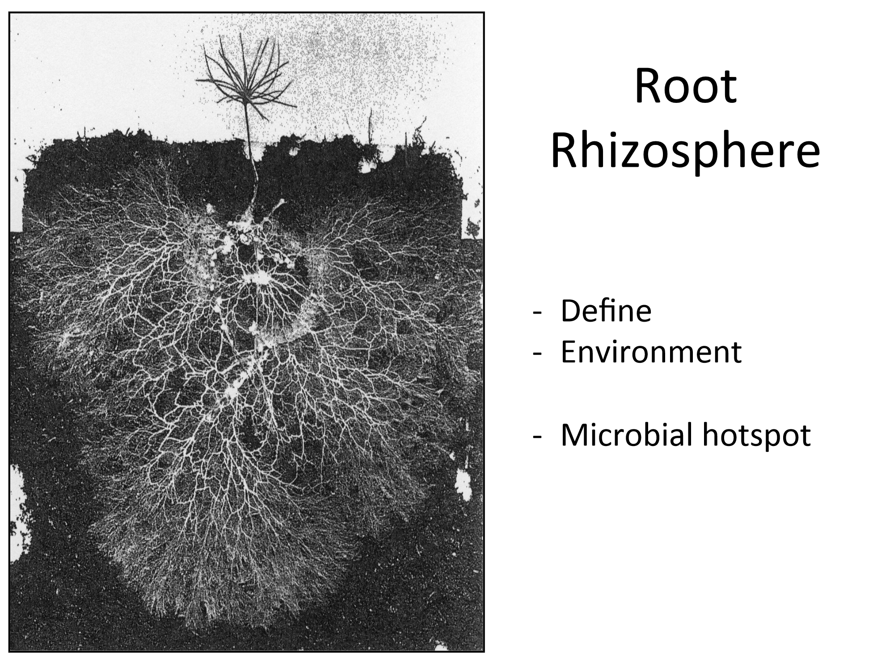

<!-- Start Writing Below in Markdown -->

# Global carbon cycle

 The global carbon cycle is a balance of fluxes between reservoirs. Currently there is an imbalance as a result of burning fossil fuels sending an enormous amount of CO2 into the atmosphere.  But, only about half of what is sent to the atmosphere accumulates there and the rest is taken into reservoirs, some into the ocean and a lot into terrestrial component – through vegetation and into soils.  Any process that increases the net movement into stable soil pools is a benefit and any process that increases net movement into the atmosphere is a cost.  There is a large range in both pools and fluxes indicating the uncertainty in our understanding of these processes and how to represent them accurately in earth systems models that generate these numbers.

[From Intergovernmental Panel on Climate Change (IPCC) 2013](http://www.ipcc.ch/report/ar5/wg1/)

# Global maps of soil C stocks

Soil organic carbon is distributed globally on land surfaces and total carbon stock is dependent on carbon concentration and depth of soil profile.  Detecting change in carbon stock on a regional or site-level is challenging because we rarely sample all the way to bedrock, and land use, management, or vegetation can impact the bulk density of soil and therefore the carbon stock if measured on a volumetric basis only at the surface of the soil profile.  One solution is to remove volume from the carbon stock equation and calculate carbon stock on an equivalent mass basis instead of volume basis.

* References Carbon Stocks
  * (Köchy et al. 2015) [doi: 10.5194/soil-1-351-2015](http://www.soil-journal.net/1/351/2015/)
* Equivalent Soil Mass method
  * (Davidson and Ackerman 1993) doi: 10.1007/BF00000786
  * (Ellert and Bettany 1995) doi: 10.4141/cjss95-075
  * (Gifford and Roderick 2003) doi: 10.1046/j.1365-2486.2003.00677.x
  * (Wendt and Hauser 2013) doi: 10.1111/ejss.12002
  * (Crow et al. 2016) [doi: 10.1080/17583004.2016.1213140](https://www.researchgate.net/publication/306433614_Carbon_balance_implications_of_land_use_change_from_pasture_to_managed_eucalyptus_forest_in_Hawaii)

# Soil horizons and soil carbon in profiles
Soil carbon persists throughout the soil profile, typically in higher concentration at the surface and lower concentration in deeper horizons of mineral soils. Permafrost and peat soils, particularly abundant in high latitudes, may have homogenous, high organic carbon concentrations throughout very deep profiles.

[From EPA CLU-IN content on terrestrial carbon sequestration](https://clu-in.org/ecotools/seq.cfm)

# Transport of organic C into and through soils
Multiple soil processes act to transform and transport organic matter in soil resulting in additions and losses throughout the profile.

 

[From FOA International Year of Soils 2015](http://www.fao.org/global-soil-partnership/overview/why-the-partnership/en/)

# Soil as an ecosystem
* **Ecosystem:** A community of organisms interacting with their environment and functioning as a system linked together by nutrient and energy flows
* High *biological diversity* is considered an indicator of high soil quality
  * *Species diversity* – number of species, distribution of numbers
  * *Functional diversity* –value and range of organismal traits that influence ecosystem functioning
    * Functional group – a set of species that have similar traits and thus are likely to have similar effects on ecosystem functioning
    * Functions of soil ecosystem?  Nutrient cycling (specifically, biological N fixation, nitrification, denitrification, etc), decomposition, water relations, etc. From a human perspective, these are “ecosystem services”.
  * *Functional redundancy* – multiple organisms have same functionality, provides stability and resilience
* *Stability* – the ability of soils to continue to perform functions of nutrient cycling, use of organic wastes, maintenance of soil structure
* *Resilience* – ability to recover following severe disturbance

From [NREM](https://www.ctahr.hawaii.edu/nrem/) 304 Fundamentals of Soil Science, University of Hawaii Manoa