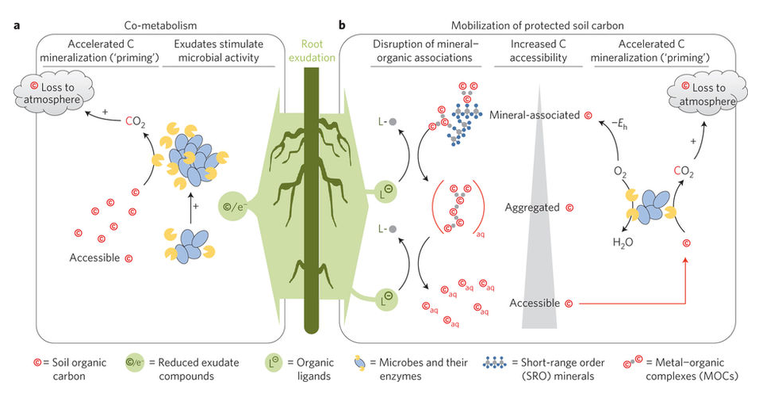
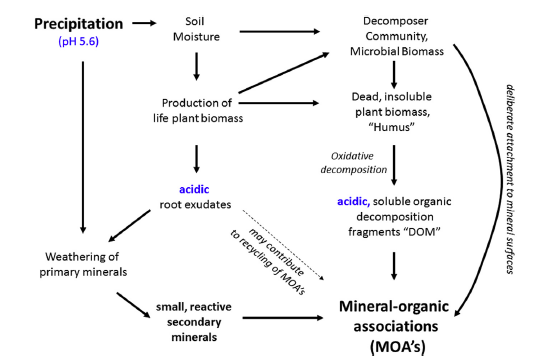

```{r setup, include=FALSE}
knitr::opts_chunk$set(echo = TRUE)
```


```{r infobox1, include=FALSE}
#I've decided to use native R to discuss the syntax and formatting of this example template.  By using include=FALSE in the R chunk definition I have effectively kept it from being included in the final product.  When using this template the template intoduction and all R chunks with "infobox" labels can be removed. 
```
#What are mineral associations with organic matter and why are they important?

Mineral-bound organic matter has been defined as organic matter that is adsorbed to minerals or entrapped in small micro-aggregates. In temperate, cultivated soils, 50-75% of the organic matter in soils exists within clay-sized organo-mineral particles (Christensen 2001). This large reservoir of SOM (and therefore also soil carbon) makes understanding the dynamics of carbon in organo-mineral particles important in understanding the overall dynamics of carbon in soils. The protection of SOM by soil mineral associations also helps to explain the persistence of SOM even after serious disturbance events (Kiem and Kogel-Knabner, 2003).



Mineral associations provide a significant stabilization mechanism for organic matter in soils. There is an increased mean residence time of OM (stabilization) due to sorption to a mineral subsoil, soil minerals, and after co-precipitation (Kleber et al, 2015). This increased residence time is explained by the physical strength of the association of organic matter with minerals and a consequent resistance to microbial decay (link to microbial access). 



References: 
Christensen, 2001
Kiem and Kogel-Knabner, 2003
Six et al, 2002
Mikutta et al., 2006
Kleber et al, 2007 
Kleber et al, 2015

#The Relationship Between Particle Size and Organic Matter

A negative correlation between particle size and organic carbon in soils has long been recognized and assumed to be proof of a close association between clays and soil organic matter (SOM). Part of the reason for this relationship is the high surface area to volume ratio of smaller particles. This high surface area provides more substrate for both colonization by microorganisms and direct adsorption of organic matter. More recent work has shown that this relationship is due also to the chemical affinity of the minerals of these smaller particles and organic matter. These interactions are now termed “organomineral associations.” Figure 3 below shows organo-mineral interactions in the right bottom corner, where molecular size is smallest and polarity (i.e. reactivity) is highest.


Carbon to Nitrogen Ratios in Soils:

Another piece of evidence suggesting the mechanisms of organomineral interactions in soils is that C:N ratio decreases as particle size decreases. In soils with high sand content, SOM stabilization is due to chemical recalcitrance of compounds, as explained by the presence of more lignins and resistant compounds that generally have higher C:N ratios (Six et al, 2002). In contrast, in soils with a high clay content, stabilization by physical and chemical mechanisms will be the primary controls over C accumulation and these soils generally also have a lower C:N ratio (Mikutta et al., 2006; von Lützow et al., 2006). These mechanisms include aggregation (link to Hannah), sorption on mineral surfaces, and entrapment within fine pores.  As shown experimentally, there are more N-containing compounds in these soils because of a higher affinity of N-compounds with mineral surfaces (Kleber et al, 2007). 


#Nature of organic matter that associates with minerals

Where does the organic matter in these interactions come from? There are many sources of the organic matter that becomes associated with minerals in soils, including that associated with plants, microbes, and necromass (dead microbial biomass). 
Plants provide a large variety of inputs to the system. These are in the form of biomass (i.e. dead plant matter), root exudates, and other plant-derived products including mucilage, cell fragments and plant-derived biopolymers. Plant-derived organic matter provides a substrate for microbes to act upon. Roots physically and chemically disintegrate substrate in soil and rocks and contribute to soil weathering by producing smaller organic molecules and acids that can either react with minerals or go into soil solution. The rhizosphere is a zone of particular interest because here, plants are able to stimulate microbial growth and more directly interact with the soil environment. 

Microbes have the ability to break down larger organic compounds into smaller functional units of organic matter. They exude acids, chelators and extracellular polysaccharides (EPS) that can be deposited directly onto minerals or go into the dissolved organic matter pool in soil. Dead microbes contribute to necromass. The organic matter in necromass has a stronger resistance to decomposition. Interestingly, the diversion of plant carbon into microbial biomass might ultimately lead to a greater accumulation of stable soil carbon.

However, recent research suggests the shortcomings in methods to characterize this minerally-associated organic matter. Traditionally, just physical fractionation has been used to separate this organic matter. However, this seems to incompletely fractionate the organic matter associated with minerals. There are also chemical treatments available that can further separate minerally-associated organic matter, and there is a growing need to perhaps combine the 2 in order to effectively characterize the organic matter that is associated with minerals. 

References:
Cotrufo et al., 2013 FROM Kallenbach et al
Dungait et al., 2012

#Other factors that influence organomineral interactions

It is not simply the source or nature of the organic matter that influences the formation of organic matter and mineral associations. Many other factors, including the mineral characteristics, water,  and pH are also significant factors in the formation of mineral associations with organic matter. 

1. Chemical and physical properties of minerals: reactive minerals with large specific surface areas are most prone to organomineral interactions. This specifically and especially includes iron oxides and aluminum silicates, as well as phyllosilicate clay minerals (Kogel-Knabner et al, 2003).

2. Water: as a solvent for reactions to occur and a medium for microbe and organic matter transport.

3. pH: low pH favors formation of reactive minerals as well as strong bonds between organic matter and minerals with charge.

Mineral associations with organic matter are facilitated under the conditions of: high soil moisture, intensive weathering and soil acidification. They can can still occur in dry, neutral/alkaline soils, but both the abundance and strength of mineral organic associations is lower and may be more prone to disturbance. 

#How does organic matter interact with minerals? 

In order for organic matter, however derived, to associate with minerals, many things need to occur. This process was first described by Hedges and Keil (1999) as the “partitioning model.” First, this organic matter must be physically broken down into smaller pieces in order to move through soil. Since water (a polar molecule) is the solvent in soil, this organic matter must become soluble in water, something that happens easily in an oxidizing environment. Oxidation also renders organic matter more reactive towards mineral surfaces. At that point, they can adsorb to those surfaces as long as conditions favor it (i.e. functional groups on OM, mineral composition, pH, etc). Alternatively, OM can be directly deposited on mineral surfaces as extracellular polysaccharides (EPS) or root exudates. 

References:
Hedges and Keil, 1999

#Nuts and Bolts: Zonal Structures

There is growing evidence for “zonal structures” on mineral surfaces with the layering of organic material on minerals. The basis for this idea comes from work by Schmidt et al 
(1990) in which they show that it is easier or harder for organic matter to dissolve depending on where in the soil the organic matter is. In other words, there are different turnover times for both C and N within the same organo-mineral complex. 
 
More recently, Physical fractionation data led Sollins et al. (2006 ) to postulate that sorption of
proteins to minerals might create a basal layer to which other amphiphilic molecular fragments would adsorb more strongly than they would to clean clay surfaces, creating a zonal eV ect, with N-rich compounds more abundant near mineral surfaces, and C-rich compounds more abundant farther from the surface.


The above figure 4 provides a visualization of organic matter interactions with various types of minerals and their associated zones. The three zones elucidated by Kleber et al (2007) are described below, and include the contact zone, the hydrophobic zone (not always present) and the kinetic zone. 

Contact zone: where OM sorbs to minerals. Contact depends on type, density and chemistry of mineral surfaces and pH of solution. OM attached here doesn’t exchange much/at all with soil solution (strong bonding) and is thus “protected”

Hydrophobic zone: chemical properties of mineral surfacers masked by OM attached at the contact zone -- can be hydrophobic zone created if hydrophobic functional groups exposed. Combined with the contact zone, this can create a “bilayer” on the mineral surface. Alternatively, polar portions of molecules can be exposed, which does not create a bilayer, but rather creates additional reactive sites that can bind to additional OM. 

Kinetic zone: variable chemical properties depending on chemical/physical properties of both the OM and the soil solution. No common principle(s) that determine what this zone looks like. Proposed to have OM with shorter residence times - OM is partitioned rather than sorbed at this point (weaker associations). Thickness of this layer may depend more on availability of OM than on chemical/physical properties thereof, and a high exchange rate is postulated for OM in this layer. 


#Coprecipitation

Coprecipitation
*need help here! 
1. complexation of hydrolyzed Fe and Al species by OM,
2. precipitation of insoluble metal–organic complexes,
3. adsorption of OM to neoformed Fe and Al oxides, and
4. occlusion of pure OM into precipitated Fe and Al oxide aggregates
