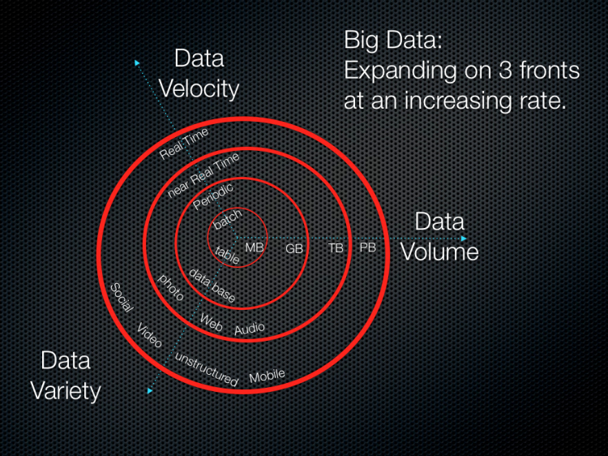

## What is big data?
{width=50%}

<!--  -->
<!-- ](abstract_scrape_no_title.png){ width=75%, angle=90} -->

The number of people and ways they interface with technology have dramatically increased the amount of human-generated data produced. Machine-generated data is produced more and more as machines increasingly are able to operate indepdent of human intvention. These factors have dramatically increased the amount, speed and kinds of data created, while also requiring advances in how this data is processed. Together, the data and and the processing now compose the core of the concept of 'big data'. 

Unifying definitions of novel and developing ideas are hard to come by, but as [big data evolved conceptually over the past two decades (Diebold, 2012)](https://economics.sas.upenn.edu/sites/economics.sas.upenn.edu/files/12-037.pdf) theoretical overlaps have helped outline the contours of big data. 

[Laney's 2001](https://blogs.gartner.com/doug-laney/files/2012/01/ad949-3D-Data-Management-Controlling-Data-Volume-Velocity-and-Variety.pdf)[pdf] work, while not the first to frame an approach, identified 'Volume', 'Velocity' and 'Variety' as crucial factors of large format (originally termed "3D") data management. The 3 V's, as they became known, are now roughly defined as follows: 

* **Volume**: the size of data used or generated

* **Velocity**: the speed of data creation, processing, 

* **Variety**: the spread of types and structures of data

{WIDTH=50%}

<!-- {width=50%} -->

In the years since Laney's work many have added more V's to the list. For example, as early as 2013 [IBM added 'Veracity'](https://www.wired.com/insights/2013/05/the-missing-vs-in-big-data-viability-and-value/)(with an [infographic](http://www.ibmbigdatahub.com/infographic/four-vs-big-data) to prove it) to highlight the importance of uncertainty, error, or other issues the data. By [2016](https://web.archive.org/web/20160114004105/http://www.ibmbigdatahub.com/infographic/extracting-business-value-4-vs-big-data), 'Value' was being included by IBM ([of course with another infographic](http://www.ibmbigdatahub.com/infographic/extracting-business-value-4-vs-big-data)). As far as V's go it seems any number greater than two is fine, be it  [seven](https://www.impactradius.com/blog/7-vs-big-data/), [ten](https://tdwi.org/articles/2017/02/08/10-vs-of-big-data.aspx), or even  [forty-two](https://www.elderresearch.com/company/blog/42-v-of-big-data).

[Ward and Barker's 2013](http://arxiv.org/abs/1309.5821) survey of big data defintions yielded a process and technology focused summary, stating that "Big data is a term describing the storage and analysis of large and or complex data sets using a series of techniques including, but not limited to: NoSQL, MapReduce and machine learning."

[De Mauro, Greco, & Grimaldi's 2015](https://doi.org/10.1063/1.4907823) meta-analysis of big data defintions includes not just the 3 V's but also 'Value', defined as the  transforming information into actionable knowledge with economic impacts, as a fourth V, as well as the technology and methods focus encompassed by Ward and Baker (2013):

> “Big Data represents the Information assets characterized by such a High Volume, Velocity and Variety to require specific Technology and Analytical Methods for its transformation into Value.”
- [De Mauro et al., 2015](https://doi.org/10.1063/1.4907823)

#### References
- De Mauro, Andrea, Marco Greco, and Michele Grimaldi. “What Is Big Data? A Consensual Definition and a Review of Key Research Topics.” AIP Conference Proceedings 1644, no. 1 (February 9, 2015): 97–104. https://doi.org/10.1063/1.4907823.

- Diebold, Francis X. “On the Origin(s) and Development of the Term ‘Big Data.’” SSRN Scholarly Paper. Rochester, NY: Social Science Research Network, September 21, 2012. https://papers.ssrn.com/abstract=2152421.

- Laney, Doug. “3D Data Management: Controlling Data Volume, Velocity and Variety.” META Group Research Note 6, no. 70 (2001). https://blogs.gartner.com/doug-laney/files/2012/01/ad949-3D-Data-Management-Controlling-Data-Volume-Velocity-and-Variety.pdf [pdf]

- Ward, Jonathan Stuart, and Adam Barker. “Undefined By Data: A Survey of Big Data Definitions.” ArXiv:1309.5821 [Cs], September 20, 2013. http://arxiv.org/abs/1309.5821.

***
## Big data and Problem Solving

> "All models are wrong, but some are useful"   
> -[George Box,  in Science and Statistics (1976)](https://doi.org/10.2307/2286841) 

A decade ago big data was heralded by some as the [end of theory (Anderson, 2008)](https://www.wired.com/2008/06/pb-theory/) and upending hypothesis-driven scientific method. While this hasn't quite come about, a number of opportunites and issues have.

### Inductive vs Deductive Approaches
Nearly three centuries ago, Hume outlined what has became known as the Problem of Induction. In broad strokes, the problem is that while we constantly use previous experiences to make judements about future experiences, inductive processes offer insufficient justification for causal conclusions. To wit, we can make a good guess (probability) but can never be be sure (certainty). 
<!-- {width=50%} -->

{width=50%}

Deductive research works to address this issue by starting with generally accepted theory and progressing through hypothesis development and observation to produce specific observations that can be confirmed with certainty.

Contrastingly, inductive research begins with observations to identeify patterns from which tentaive hypotheses and generalized theories can be developed. 

The problem of induction highlights taht these generalized theories are impossible to verify. Additionally small observation sizes weaken the probability of generalized theory to have broader value. The disruptive potential of big data, as laid out by Andersion ([2008](https://www.wired.com/2008/06/pb-theory/)), is that when observation sizes become increasingly vast it calls into question if correlation, albeit massive, is sufficient as a scientific output. 

{width=50%}

To some degree this mimics the distinction between [confirmatory and exploratory research (Jaeger and Halliday, 1998)](http://www.jstor.org/stable/3893289). While deductive research aims to confirm a hypothesis through specific (and logically defensible?) observations, exploratory research parses obersvations to discern patterns and produce hypotheses to be tested.

[Google's Flu rate prediction bungle](http://science.sciencemag.org/content/343/6176/1203) provides an interesting case of how bias, sampling, and other errors come easily into play when generally accepted scientific practice is left by the wayside in preference of the power of correlation. 

### Data-Driven Science
For a long time the scientific method has dictated that study should follow a distinct process to be valid. This led to questioning of the human genome mapping project as valid science, since it was not hypothesis fueled (i.e., deductive or confirmatory) but more so an exploratory (i.e., inductive) data generating process ([Carroll and Goldstein, 2009](https://www.nature.com/articles/nmeth0409-237). 

Now, however data-driven science has begun to lose its stigma; both in the sense of data-driven research that generates data of potential use (see 'omics' research review in [Carroll and Goldstein, 2009](https://www.nature.com/articles/nmeth0409-237)) as well as using big data exploration to drive further exploration or produce initial hypotheses that can be tested using a more deductive approach.

### Enter Machine Learning
The volume of data and the technological requirements to process it have led to novel approaches to analysis like [Map Reduce](processing across mutiple servers) and [Machine Learning](). Machine learning involves giving computers the ability to learn without being explicity programmed. For example, 

As mentioned above, for Ward et al., the processing techniques can be as useufull in defining a big data project as the qualities of the data itself (e.g., size, structure, etc), and  will often require novel or specific advanced processing approaches.

See http://news.codecademy.com/what-is-machine-learning/ for more. 

***

<!-- ## Problems in Big Data solutions -->
<!-- #### Bias -->
<!-- There is not uniform access to the systems that generate big data, and thus there will almost inevitably be a slant in any analysis performed on the data. This is in part addressed by good understanding of how the data is generated and the steps involved in processing.  -->

<!-- #### Privacy -->

<!-- #### Correlation over causation? -->

***
#### References

- Anderson, Chris. “The End of Theory: The Data Deluge Makes the Scientific Method Obsolete.” Wired Magazine 16, no. 7 (2008): 16–07. https://www.wired.com/2008/06/pb-theory/.

- Hume, David. A Treatise of Human Nature, 2003. https://www.gutenberg.org/ebooks/4705.

- Jaeger, Robert G., and Tim R. Halliday. “On Confirmatory versus Exploratory Research.” Herpetologica 54 (1998): S64–66. http://www.jstor.org/stable/3893289.

***

### So, are we there yet?
Is the [SOC-HUB](outlink) a "big data" project? In light of the information on the above, lets look at a few questions to help determine if we're wading into big data.

**First, is the data charaterized well by the definitions offered above, namely the 3 V's?**

The **volume** of data is currently limited to information held in already published papers or currently ongoing research studies.

The **velocity** of the data is limited by the speed at which graduate students will be entering templated data into the hub. As the userbase isn't likely to reach that of a social media platform, SOC-HUB data velocity will be low. 

The **variety** of data will be somewhat limited to the structure of the templates used. Meaning that while initial data, housed in research articles, may be unstrucrted and in various formats, the data entering the SOC-HUB will be structured to meet the needs of later processing. 

**Second, will data processecing use or require techniques that are specialized to address the complexities of big data?**

At the 

**Finally, in light of the above, what might a big data project for SOC look like?**

## References/Figures

***

