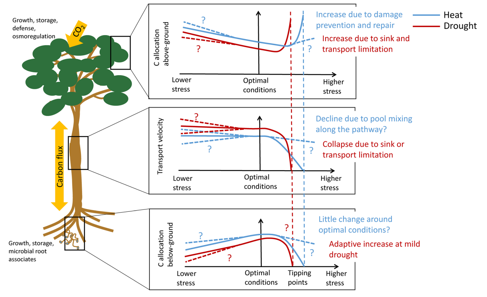

```{r setup, include=FALSE}
knitr::opts_chunk$set(echo = TRUE)
```


#Photosynthesis, our solar energy converter

Carbon in the air is magically placed into the soil by tiny brilliant elves. Just kidding. But sort of- it’s actually a very complex process of interactions between microbial life and plants that we have to thank for this crucial step in the carbon cycle, a benefit to the system. 

Photosynthesis is the first step of carbon entering the soil, when atmospheric carbon in the form of carbon dioxide (CO2) is transformed within plants using solar energy, into stored energy within plants in the form of carbon. Chloroplasts host the process of photosynthesis where primary reduction reactions convert CO2 into energy-rich carbohydrates, which are used as an energy currency for the plant and organisms within the ecosystem, with oxygen as a byproduct. (Insert figure of photosynthesis and carbohydrate production). 

Three different metabolic pathways exist for carbon dioxide fixation in plants which also categorizes plants into groups: C3, C4, and CAM. High temperatures and dry weather favor C4 and CAM plants, which are adapted to these areas to increase photosynthetic efficiency. Photosynthetic capacity is also variable through the course of plant development and among species. While respiration and carbon uptake through photosynthesis is only the first step to carbon being stored in the soil, its important to acknowledge that these factors play a role in carbon fixed from the atmosphere and how carbon fixation in climates with increasing temperatures may be impacted. 

![Figure 1. Photosynthesis and carbohydrate production]

References:

Larcher, Walter (1995) DOI: [10.1016/S0016-7061(96)00036-5](https://doi.org/10.1016/S0016-7061(96)00036-5)

#Carbon use within plants

Once carbohydrates are created within the plant, they are used as the physical plant building blocks (organic matter) and generate the energy for plant growth. Carbon from the atmosphere becomes the structural components of vegetation, including above and below ground plant mass. Where carbon is allocated within the plant can be impacted by environmental conditions such as heat and drought (9). In the tundra, where large amounts of the world’s soil carbon is stored, increased temperatures may shift plant biomass allocation above ground (Wang et al., 2016).



#Interactions of carbon from plant biomass with soil environment

Carbon enters the soil from plants, and the resulting soil organic matter cycles into the soil profile by multiple processes. To enter the soil, carbon can leave the plant as root exudates or as plant litter, further decomposed by microorganisms. A large portion of a plants photosynthetically fixed carbon enters the soil through root exudates, which consist of organic compounds and enzymes that protect and support the plant within the diverse microorganism community living in the rhizosphere (Marschner, 1995, Walker et al., 2003) (10). 

] DOI: (http://www.plantphysiol.org/content/plantphysiol/132/1/44/F1.large.jpg?width=800&height=600&carousel=1)

Plant litter is decomposed by a host of soil fungi and bacteria into microbial products and biomass. Once in the soil, carbon cycles by physical mixing via decomposers such as earthworms and microorganisms, mineral-organo associations, and by freeze/thaw cycles within certain climates. 

](https://media.springernature.com/m685/nature-assets/nature/journal/v478/n7367/images/nature10386-f3.2.jpg)


List of important publications:

Schmidt et al. (2011) DOI: [10.1038/nature10386](https://www.nature.com/articles/nature10386)


#Carbon sources for carbon sequestration

Vegetation type, management, and biomass location (above ground or below ground biomass) can vary the amount of plant biomass carbon retained in the soil organic matter (SOM). In (3), we see that soybeans, for example, show a high ratio of below ground to above ground carbon inputs retained in the (SOM), as well as organic agriculture practices. The dominance of belowground carbon being retained in the SOM shows the importance of root sourced carbon in long term carbon stabilization. 


#Soil organic matter formation and agroecosystems

SOM formation is crucial to the soil ecosystem, and is nearly 50% carbon. The soil organic carbon (SOC) is responsible for a whole host of soil health functions. Increased SOM has been linked to higher resistance to disease, erosion, nutrient retention, and supporting crucial microbial life. In order for the SOC in SOM to be stored long term, or sequestered, various supporting processes must break it down from its plant material while also being protected from release back to the atmosphere. Managed ecosystems often have reduced SOM in their systems due to increased disturbance, whereas natural systems show higher SOM. Increasing SOM is a major goal for global soil health initiatives, and to better reflect the functions of a natural system within managed agroecosystems. 


```{r infobox2, include=FALSE}
#above is the first example of inserting an image into your Rmarkdown file.  the '' syntax is used.  You start with an '!'.  Then Within the brakets [] you include the text that you want included as the figure caption.  Then Within the parentheses () you include the link to where the image can be found; the image is from the web in the above example.  I have also nested the link to Schmidts paper's DOI within the figure text which is why it appears complicated.  Below is a similar example with a different image.  Remember you will be copying this template and, though trial and error, it will begin to make sense... and if it doesnt, we'll help you in class. 
```


