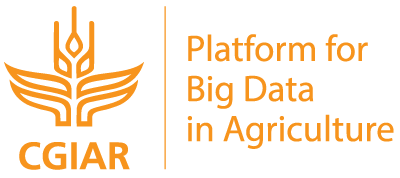
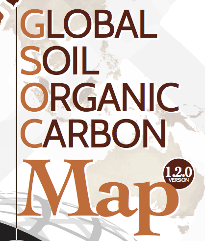
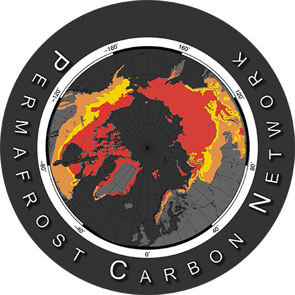

## Whats big with big data and agriculture?

{width=50%}

In 2017 [CGIAR](http://www.cgiar.org/) (aka the Consultative Group for International Agricultural Research) commenced a six-year [Platform for Big Data in Agriculture](http://bigdata.cgiar.org/) to harness "the power of big data for agricultural research and development." CGIAR is a major player in international agricultrual research and, whether as a herald or Johnny-come-lately, the decision to have big data thematically underpin the breadth of their work speaks to the volume, velocity, and variety of the potentials and promises of big data itself in agriculture. So what is all the hype about?

### Uses & Applications
The proliferation of various agricultrual data types from satelite imagery, the outputs of a growing coprus of internet of things in agriculture ([Verdow, Wolfert, and Tekinerdogan, 2016](https://www.researchgate.net/publication/312164156_Internet_of_Things_in_agriculture)), financial, regulatory, and yeild data have all expanded the potentials of big data use in agriculture. There are multiple push-pull drivers for the use of big data in agriculture ([Wolfert, Verdouw, and Bogaardt 2017](https://www.sciencedirect.com/science/article/pii/S0308521X16303754#f0010)). The pull factors involve incresed business efficiencies that may be found through big data approaches like precision agriculture. While  push factors like increased traceabiity (along with surveillance and monitoring) along supply chains are due to food safety concerns and regulation. 

Climate and weather predictions, yield forecasting, and market assessment have all been around for some time, but big data has made waves in these more established realms too. For example, The Climate Corporation, a weather and climate processing firm, was [acquired by Monsanto in 2013 for nearly $1 billion USD](https://www.forbes.com/sites/bruceupbin/2013/10/02/monsanto-buys-climate-corp-for-930-million/#1a343a5f177a). Meanwhile the the various promises of precision agriculture have captured the [imaginations](http://fortune.com/2014/05/30/cropping-up-on-every-farm-big-data-technology/) and [markets](https://www.reuters.com/brandfeatures/venture-capital/article?id=14966) as well.   

Not all of the activities in big data and agriculture are quite so propritary and market driven though. The [Global Open Data for Agriculture & Nutrition](http://www.godan.info/) is "promoting the proactive sharing of open data to make information about agriculture and nutrition available, accessible and usable" through tranings, toolkits and free data access.

Next, we'll look at some of the big data projects focused on soil carbon.

*** 
## Soil Carbon and Big Data
As interest and opportunities with big data have grown, so too has the nubmer of organizations focused big data and on soil carbon. 

At the global scale there is the [International Soil Carbon Network](http://iscn.fluxdata.org/), a “collaborative organization composed of scientists who recognize a need for and value in large-scale synthesis of soil carbon science.”  

{width=100px}

The Food & Agriculture Organization of the United Nations has been working on a [Global Soil Organic Carbon Map](http://www.fao.org/global-soil-partnership/pillars-action/4-information-and-data/global-soil-organic-carbon-gsoc-map/en/) project. You can check out the web-application version [here](http://54.229.242.119/apps/GSOCmap.html).

{width=120px} 

Other entities and project have a regional focus, like the [Permafrost Carbon Network](http://www.permafrostcarbon.org/) which aims to "synthesize existing research about permafrost carbon and climate in a format that can be assimilated by biospheric and climate models". 

The [Woods Hole Research Center's newly funded project](https://portal.nifa.usda.gov/web/crisprojectpages/1012267-soil-carbon-cycle-science-in-the-big-data-era.html) focuses on the Great Plains to vet research to "build a methodology to rapidly predict numerous soil properties from one rapid and inexpensive measurement". 

The [Soil Carbon Information Hub](https://powellcenter-soilcarbon.github.io/SOC-Hub/), beyond the goal of being an informational resource, is distinct in its focus on on radiocarbon and fractioning data.

## Outlook and Caveats
As with any tools, technology can be weilded in various ways and more recently concerns have arose about the relationship between data, those who produce it, and those who control it. Concerns over data collection and ownership have now reached the level of potentially being addressed in the [2018 US Farm Bill](https://www.chlpi.org/big-data-big-questions-2018-farm-bill-landscape-data-privacy-security-ownership/). 

Internationally there are also concerns about how technology driven development can serve as a trojan horse for collecting data of increasing value, and the potential for the inclusion of 'data sovreignty' in the work of food sovreignty practitioners ([Fraser, 2018](https://www.tandfonline.com/doi/abs/10.1080/03066150.2017.1415887?journalCode=fjps20)).

No matter how data ownership laws progress, the increased use and production of data in agriculture is likely to continue. For researchers and scientists, the manner in which data is produced, processed and shared can help shape these discussions.

#### References
- Fraser, A. (2018). Land grab/data grab: precision agriculture and its new horizons. The Journal of Peasant Studies, 1-20. Retreived from https://www.tandfonline.com/doi/abs/10.1080/03066150.2017.1415887

- Shekhar, S., Schnable, P., LeBauer, D., Baylis, K., & VanderWaal, K. Agriculture Big Data (AgBD) Challenges and Opportunities From Farm To Table: A Midwest Big Data Hub Community Whitepaper. https://pdfs.semanticscholar.org/c815/75e059a826f39b47367fceaac67a8f55fb07.pdf

- Verdouw, C. N., Wolfert, S., & Tekinerdogan, B. (2016). Internet of Things in agriculture. CAB Reviews: Perspectives in Agriculture, Veterinary Science, Nutrition and Natural Resources, 11. https://www.researchgate.net/publication/312164156_Internet_of_Things_in_agriculture

- Wolfert, S., Ge, L., Verdouw, C., & Bogaardt, M. J. (2017). Big data in smart farming–a review. Agricultural Systems, 153, 69-80. https://www.sciencedirect.com/science/article/pii/S0308521X16303754#f0010. 

